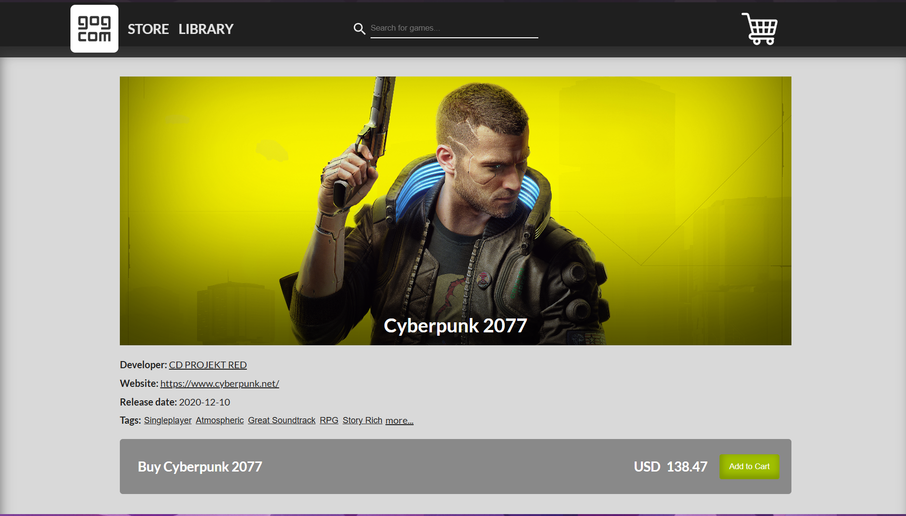
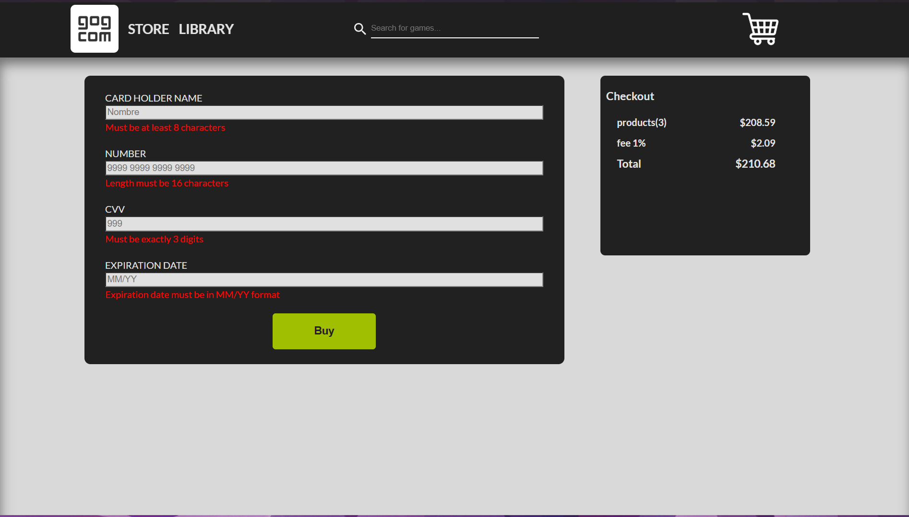
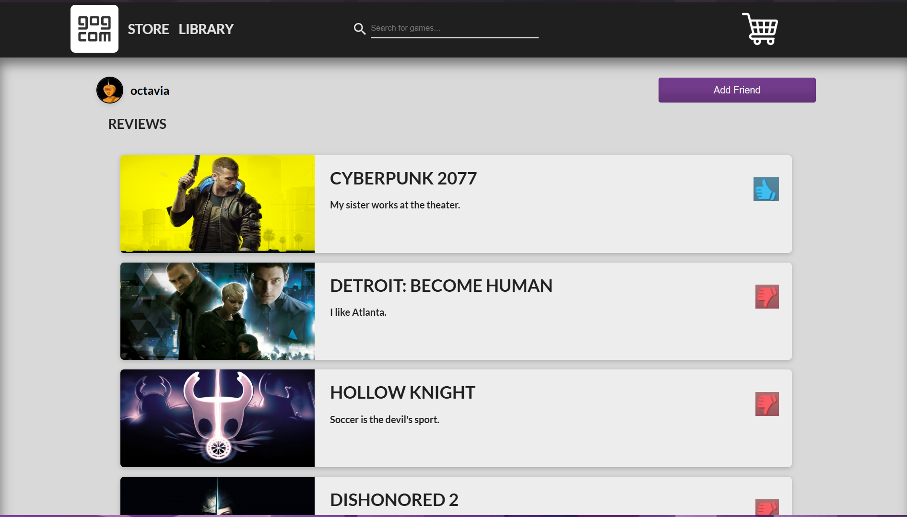

# GOG – Tienda digital de videojuegos multiplataforma

Aplicación de e-commerce de videojuegos inspirada en la plataforma GOG, que replica sus funcionalidades principales en versiones web y móvil.

El proyecto fue desarrollado en tres capas:
* API REST en ExpressJS y NodeJS
* Aplicación web en ReactJS y JavaScript
* Aplicación móvil en React Native y TypeScript

### Funcionalidades principales
* Registro y autenticación de usuarios
* Catálogo de videojuegos con etiquetas
* Sistema de reseñas
* Carrito de compras y gestión de transacciones
* Sistema de amistades entre usuarios y perfiles
* Busquedas
* Interfaz moderna, intuitiva y responsive
* Validacion de datos en el pago

### Tecnologías utilizadas
* React
* React Native
* Redux
* TypeScript
* JavaScript
* ExpressJS
* NodeJS
* CSS
* HTML

### Imagenes del proyecto

<p>
  
  
  
</p>
<p>
  
  
  
</p>
<p>
  
  
  
</p>

### ¿Cómo descargar y ejecutar el proyecto?
API REST:
```bash
cd api
npm install
npm run dev
```
Aplicación Web:
```bash
cd web
npm install
npm run dev
```
Aplicación Mobile:
```bash
cd mobile
npm install
npx expo start
```
Abrir en el navegador o en Expo en dispositivos móviles.

### Más información

Este proyecto fue desarrollado en grupo junto a 3 compañeros para la materia Construcción de Interfaces de Usuario. Decidí crear este repositorio ya que no me fue posible hacer un fork del original.
